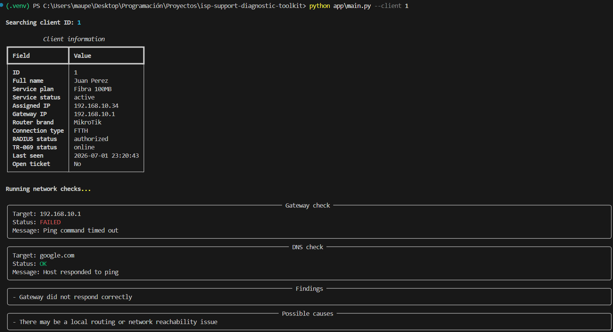

# ISP Support Diagnostic Toolkit

Herramienta de práctica en Python para simular un flujo básico de soporte técnico en un proveedor de internet.

El proyecto permite buscar un cliente en una base de datos MySQL, revisar su estado de servicio, ejecutar chequeos simples de red y generar un reporte técnico en Markdown con posibles causas y próximos pasos.

## Índice

- [Descripción](#descripción)
- [Funcionalidades](#funcionalidades)
- [Herramientas usadas](#herramientas-usadas)
- [Estructura del proyecto](#estructura-del-proyecto)
- [Cómo funciona](#cómo-funciona)
- [Instalación](#instalación)
- [Levantar MySQL con Docker](#levantar-mysql-con-docker)
- [Uso](#uso)
- [Ejemplo de ejecución](#ejemplo-de-ejecución)
- [Reportes generados](#reportes-generados)
- [Notas importantes](#notas-importantes)
- [Posibles mejoras](#posibles-mejoras)

## Descripción

Este proyecto simula un flujo básico de diagnóstico para soporte técnico en un proveedor de internet.

El objetivo es practicar cómo un operador podría consultar información de un cliente, revisar el estado del servicio y obtener una primera orientación sobre posibles causas del problema, como falta de IP asignada, router offline, fallas básicas de conectividad, errores de DNS o estados simulados de RADIUS y TR-069.

La herramienta no se conecta a infraestructura real de ISP. Los datos y estados técnicos están simulados en una base MySQL local para poder practicar el flujo de diagnóstico en un entorno controlado.

## Funcionalidades

- Consulta de clientes desde una base de datos MySQL.
- Revisión del estado del servicio.
- Validación de IP asignada y gateway.
- Chequeo básico de conectividad con `ping`.
- Chequeo básico de DNS.
- Simulación de estados RADIUS y TR-069.
- Detección simple de posibles causas.
- Generación automática de reportes técnicos en Markdown.
- Flujo de trabajo por terminal, simple y fácil de probar.

## Herramientas usadas


### Tecnologías principales

- **Python**: lógica principal de la herramienta.
- **MySQL**: base de datos con clientes ficticios.
- **Docker Compose**: entorno local para levantar MySQL fácilmente.
- **Rich**: salida más clara y visual en la terminal.
- **python-dotenv**: manejo de variables de entorno.
- **mysql-connector-python**: conexión entre Python y MySQL.

### Conceptos practicados

- TCP/IP básico.
- Gateway.
- DNS.
- Estado de servicio.
- Diagnóstico de cliente.
- RADIUS simulado.
- TR-069 simulado.
- Reporte técnico.

## Estructura del proyecto

```txt
isp-support-diagnostic-toolkit/
│
├── app/
│   ├── main.py
│   ├── db.py
│   ├── network_checks.py
│   └── report_generator.py
│
├── database/
│   └── mock_data.sql
│
├── docs/
│   └── support_flow.md
│
├── reports/
│   └── .gitkeep
│
├── assets/
│   └── screenshots/
│       └── client-diagnosis-example.png
│
├── .env.example
├── .gitignore
├── docker-compose.yml
├── README.md
└── requirements.txt
```

## Cómo funciona

El flujo general es:

1. El operador ejecuta el programa indicando el ID de un cliente.
2. La herramienta busca el cliente en MySQL.
3. Se muestran los datos principales del servicio.
4. Se ejecutan chequeos básicos de red.
5. Se analizan posibles causas.
6. Se genera un reporte en la carpeta `reports/`.

Ejemplo:

```powershell
python app\main.py --client 1
```

## Instalación

Crear el entorno virtual:

```powershell
python -m venv .venv
```

Activar el entorno virtual en Windows:

```powershell
.\.venv\Scripts\Activate.ps1
```

Instalar dependencias:

```powershell
pip install -r requirements.txt
```

Crear un archivo `.env` usando `.env.example` como referencia.

Ejemplo:

```env
DB_HOST=localhost
DB_PORT=3307
DB_NAME=isp_support_db
DB_USER=isp_user
DB_PASSWORD=isp_password
```

## Levantar MySQL con Docker

Desde la raíz del proyecto:

```powershell
docker compose up -d
```

Verificar que el contenedor esté corriendo:

```powershell
docker ps
```

Para entrar a MySQL dentro del contenedor:

```powershell
docker exec -it isp_support_mysql mysql -u isp_user -p
```

Password:

```txt
isp_password
```

Dentro de MySQL se puede probar:

```sql
USE isp_support_db;
SHOW TABLES;
SELECT * FROM clients;
```

## Uso

Ejecutar diagnóstico para el cliente 1:

```powershell
python app\main.py --client 1
```

Otros ejemplos:

```powershell
python app\main.py --client 2
python app\main.py --client 3
```

Cliente inexistente:

```powershell
python app\main.py --client 999
```

## Ejemplo de ejecución




En este ejemplo, el gateway `192.168.10.1` no responde porque es una IP privada usada como dato simulado. Esto permite mostrar cómo la herramienta detecta un posible problema de conectividad dentro del flujo de soporte.

## Reportes generados

La herramienta genera reportes en Markdown dentro de la carpeta `reports/`.

Ejemplo:

```txt
reports/client_1_report.md
```

Los reportes generados están ignorados por Git porque son salidas locales de ejecución.

## Notas importantes

Este proyecto no se conecta a infraestructura real de ISP.

Los estados de RADIUS y TR-069 están simulados para practicar el razonamiento técnico y el flujo de soporte sin depender de equipos reales.

## Posibles mejoras

- Agregar un menú interactivo por consola para facilitar el uso sin recordar comandos.
- Permitir búsqueda de clientes por nombre, además del ID.
- Agregar una tabla de tickets para relacionar el diagnóstico con reclamos abiertos.
- Generar reportes en PDF además de Markdown.
- Simular historial de caídas o eventos del servicio.
- Agregar pruebas unitarias para validar la lógica de diagnóstico.
- Crear una interfaz web simple para ejecutar diagnósticos desde el navegador.
- Incorporar logs de diagnóstico para registrar errores, consultas y resultados de ejecución.
